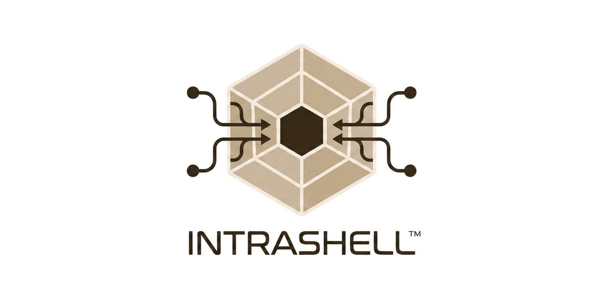
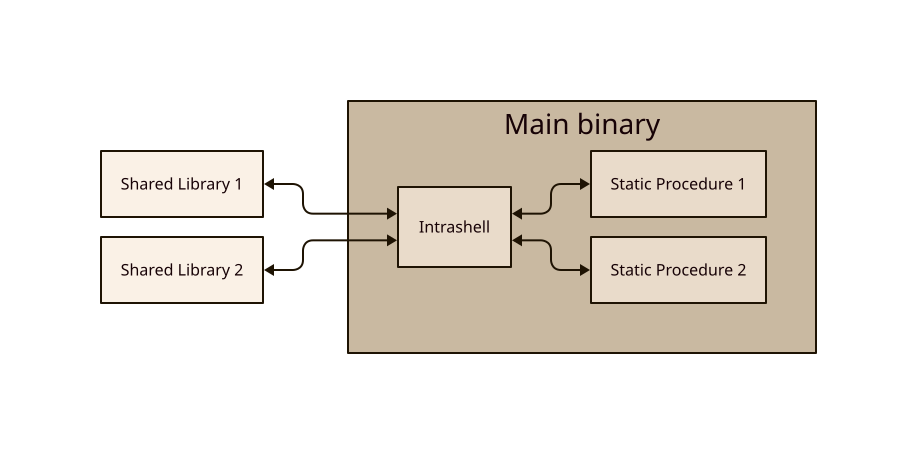
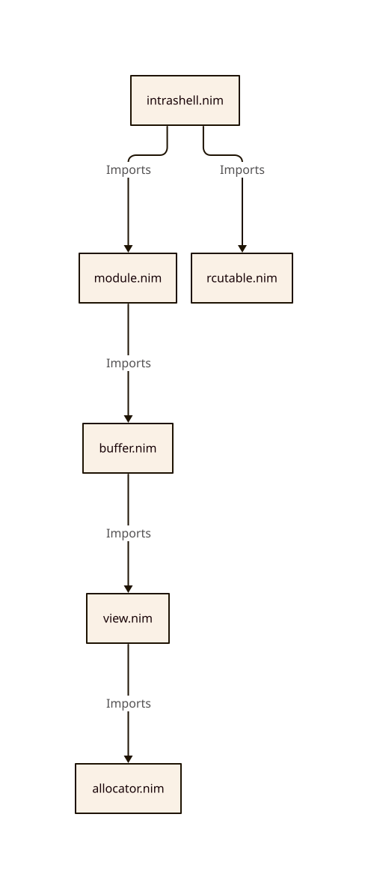

# Intrashell

A lightweight library for using shared libraries as dynamic modules in Nim.
This is achieved by enforcing a common procedure signature that simulates the
behaviour of CLI applications (which are state-machines).

## Installation

`nimble install intrashell`

Or add to your `.nimble` file:

`requires intrashell`

### Notes

- Requires Nim **2.0.0** or newer
- Must use with memory management set to either:
  - `--mm:arc`
  - `--mm:orc`
  - `--mm:Atomicarc`
- Modules in the form of shared libraries must use the flags `-d:useMalloc --app:lib`
- The main binary and the modules can use different combinations of memory management, one does not constrain the other
- Only dependency is Nim's standard library

## Table of Contents

- [What It Does](#what-it-does)
  - [Minimal Example](#minimal-example)
- [Features](#features)
  - [Technical Features](#technical-features)
  - [Architectural & Team Benefits](#architectural--team-benefits)
- [Goals](#goals)
- [Module creation](#module-creation)
  - [Stateless Module Example](#stateless-module-example)
  - [Stateful & Host-Calling Module Example](#stateful--host-calling-module-example)
- [Implementation Details](#implementation-details)
- [Caveats & Workarounds](#caveats--workarounds)
- [AI Disclaimer & Attributions](#ai-disclaimer--attributions)

## What It Does



It provides an `Intrashell` object that handles the loading, managing, and
initializing of modules in the form of state-machines that receive and return
a single sequence of strings `seq[string]` which are either compiled shared
libraries (`.dll`, `.so`, `.dylib`) or static procedures. This object provides:

- A `processOperations()` procedure that executes batch module lifecycle operations (`LOAD`, `UNLOAD`, `UPDATE`, `ROLLBACK`) created via `newOperation()`. It returns a sequence of strings (`seq[string]`) that contains any raised errors.
- A `shell()` procedure that interprets a variable number of strings as a command (module identity), subcommand, and its arguments, returning a sequence of strings (`seq[string]`) as output.

### Minimal Example

```nim
# plugin.so
import intrashell
proc yourProc(input: seq[string]): seq[string] {.raises: [WrongParameters, CommandFailed].} =
  return input

dispatchBoilerplate(yourProc)
```

```nim
# host.nim
import intrashell
import std/paths

# 1. Create an Intrashell instance. Must be global if it is going to be used by
# multiple threads
var myIntrashellInstance = newIntrashell()

# 2. Declare some variables to hold the fields of the `Module` object
let
  cmd = "my_cmd" # Declare a name (identity) for the module
  v1 = Version(major: 1, minor: 0, patch: 0) # Declare a version for the module
  file = Path("plugin.so") # Declare the path to the file

# 3. Load a Shared Library-based module dynamically
discard myIntrashellInstance.processOperations(
  newOperation(LOAD, cmd, v1, file)
)

# 4. Dispatch commands through the unified shell interface
let output = myIntrashellInstance.shell(cmd, "subcommand", "arg")
if output.len > 0:
  echo output[0] # Read the first string of the output

# 5. Declare static modules
let v2 = Version(major: 2, minor: 0, patch: 0) # New version for the module

proc yourProc(input: seq[string]): seq[string] {.raises: [WrongParameters, CommandFailed].} =
  return input
dispatchBoilerplate(yourProc) # This creates a wrapper procedure called `dispatch`

# 6. Perform live hot-updates, rollbacks, or clean unloads
discard myIntrashellInstance.processOperations(
  newOperation(UPDATE, cmd, v2, dispatch),
  newOperation(ROLLBACK, cmd, v1, file),
  newOperation(UNLOAD, cmd)
)
```

## Features

### Technical Features

- **Zero-Downtime Updates & Rollbacks**: Inject, hot-update, or rollback dependencies at runtime using semantic versioning (`Version`).
- **Unified Interface**: Modules are built as state-machines registered under a single registry with a common interface.
- **Concurrent RCU Registry**: Read and modify the module registry safely across threads and async tasks backed by a lockless RCU hash table.
- **Shared Resource Gateways**: Encapsulate stateful resources (variables, data structures, database connections, buffers, ...) behind isolated modules.
- **Inter-Module Communication**: Enable modules to invoke each other and dispatch commands using host registry pointers.
- **Binary-Safe FFI (`Buffer`)**: Transfer binary data, UTF-8 strings, and raw pointers without null-byte (`\0`) truncation across FFI boundaries.
- **Deterministic Lifecycle Hooks**: Automated `INIT` initialization (passing host pointers) and `SHUTDOWN` cleanup signals on module load/unload.
- **Shared Library Compatibility**: Runs on any operating system or execution environment that supports shared libraries (`.so`, `.dll`, `.dylib`).

### Architectural & Team Benefits

- **State-Machine Design Discipline**: Simplifies overall architecture by offloading business logic into pure, self-contained state-machines in shared libraries (`.so`, `.dll`). Minimal host binaries stay clean, while strict state-machine boundaries eliminate code smells and architectural debt.
- **Self-Contained Binary Packaging**: Simplifies deployment down to standalone shared libraries (`.so`, `.dll`), which can statically link internal dependencies for zero-friction, self-contained distribution.
- **Two-Way IP Confidentiality**: Protects proprietary source code without sharing repository access. Host owners can outsource modules by providing only OS/CPU target specs, while third-party vendors can ship pre-compiled binaries without revealing module source code.
- **Decoupled Team Workflows**: Isolated module boundaries allow separate teams and contractors to develop, test, and deploy features independently without merge conflicts or tight build-time dependencies, enabling smooth, risk-free updates.
- **Strict FFI Exception Boundary**: Locks the module's entry point to only raise `WrongParameters` and `CommandFailed`. This enforces exception handling at the modules, preventing crashes in the host application.
- **LLM-friendly Module Boundaries**: Enables safe code delegation to LLMs by isolating module generation to a single, simple procedure signature. The strict FFI exception boundary prevents unhandled errors from breaking the host, while requiring minimal context for prompts.
- **Lightweight Alternative to Containers & Script Runtimes**: Serves as a native structural alternative to containers and JS/WASM runtimes specifically for module hot-swapping, component isolation, and plugin dispatch—delivering container-like modularity without virtualization daemons or JS engine memory overhead.

## Goals

- Depend at most of Nim's standard library
- Only support native binaries
- Be cross-language and maintain bindings to multiple languages (WIP) like:
  - C
  - Zig
  - Rust
- Be cross-platform
- Be flexible enough to be used in a wide range of applications, including:
  - Web servers
  - Games
  - CLI/TUI utilities
  - Web applications (through WASM and with support for only static procedures)

## Module creation

Modules expose an entry point procedure matching `UserSuppliedDispatch`
(`proc(parameters: seq[string]): seq[string] {.raises: [WrongParameters,
CommandFailed].}`) and use the `dispatchBoilerplate` template to automatically
handle memory allocation, FFI signature export, and zero-copy data serialization
via `Buffer`.

### Stateless Module Example

```nim
import intrashell

proc entryPoint(parameters: seq[string]): seq[string] {.raises: [WrongParameters, CommandFailed].} =
  # Simply returns the input
  return parameters

# Generate FFI bindings and dispatch glue
dispatchBoilerplate(entryPoint) # creates a wrapper procedure called `dispatch`
```

### Stateful & Host-Calling Module Example

When a module is loaded or unloaded, Intrashell automatically executes
`INIT` and `SHUTDOWN` commands. During `INIT`, parameter 1 contains a
pointer to the host `Intrashell` instance, which can be deserialized using
`castStringToIntrashellPtr`:

```nim
import intrashell
import std/strutils

var
  ushell: IntrashellPtr
  state: int

proc entryPoint(parameters: seq[string]): seq[string] {.raises: [WrongParameters, CommandFailed].} =
  result = @[]
  let command = parameters[0]
  let arguments = 1..high(parameters)

  case command
  of INITCOMMAND:
    try:
      # Retrieve pointer to host Intrashell instance
      ushell = castStringToIntrashellPtr(parameters[1])
    except Exception:
      discard
    state = 0
  of SHUTDOWNCOMMAND:
    ushell = nil
    state = 0
  of "set":
    try:
      state = parameters[1].parseInt()
    except Exception:
      discard
  of "get":
    result = @[$state]
  of "call":
    # Safely invoke another module registered in the host Intrashell instance
    if ushell != nil:
      result = ushell.shell(parameters[arguments])

dispatchBoilerplate(entryPoint)
```

## Implementation Details



Intrashell relies on two main components to achieve thread safety and low FFI overhead:

- **RCU Table (`RcuTableRef`)**: A lockless-reader hash table. Readers acquire a reference to the active table with zero locking overhead, relying on Nim's ARC/ORC/AtomicARC reference counting to prevent premature deallocation. Writers acquire a single lock, copy the inactive table, swap the atomic index (`activeSlot`), and allow old references to be freed when readers finish.
- **Flat Buffer (`Buffer` / `Darray[char]`)**: A flat, contiguous memory structure used to pack multiple strings into a single chunk of memory for FFI. It avoids standard C strings (`cstring`) to prevent truncation on null bytes (`\0`), making it safe for binary payloads, pointers, and UTF-8 data across language boundaries.

The entire codebase is less than 1500 LOC and it contains comments explaining
the inner workings of each file, so go ahead and give it a read.

## Caveats & Workarounds

| Caveat | Workaround |
| ------ | ---------- |
| Lack of support for custom procedure signatures / use of a single procedure signature | The single procedure signature is necessary to  make exporting and importing modules automatic, but one can pass pointers to custom procedures through the `shell()` procedure (using the `castPointerToString()` and `castStringToPointer()` helpers) |
| Input sanitization is required at the host and every module logic | Define simple positional based APIs to simplify input handling |
| The `shell()` procedure doesn't support asynchronous/parallel tasks | Implement 2 task types: one for batching tasks and another for fetching their status |
| The `Buffer` copies memory to pass inputs/outputs, it's wasteful | This is intended to change in V2.0.0, but for now try to limit the size of the data that is passed through the `shell()` procedure |

## AI Disclaimer & attributions

- **All library code was written by my own human hand**
- **Some files were generated using online templates and generators**:
  - `CONTRIBUTING.md`: [Dev Toolbox](https://www.dev-toolbox.tech/tools/contributing-generator)
  - `docs/assets/architecture-diagram.svg`: [D2 Lang Playground](https://play.d2lang.com)
  - `docs/assets/explanatory-diagram.svg`: [D2 Lang Playground](https://play.d2lang.com)
- **Some documentation files and assets were drafted or completely made with AI**:
  - `README.md`: drafted with Gemini
  - `TRADEMARK.md`: made with Gemini
  - `docs/assets/logo.png`: made with Gemini
